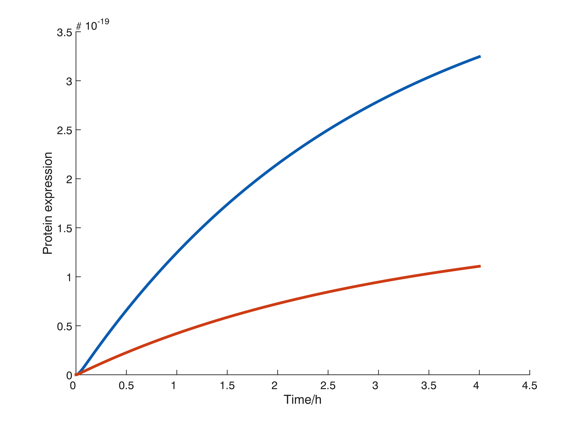

# DNAsupercoil
A model of a DNA supercoiling insulator in a translation-transcription system.

The concentration upstream gene is plotted and blue and the downstream gene in red.

### References
The base supercoiling model is adapted from:  
Yeung, Enoch, et al. "Modeling the effects of compositional context on promoter activity in an E. coli extract based transcription-translation system." *Decision and Control (CDC), 2014 IEEE 53rd Annual Conference*. IEEE, 2014.

### Disclaimer
This code has not been reviewed or tested sufficiently. There is no guarantee that it is correct.
